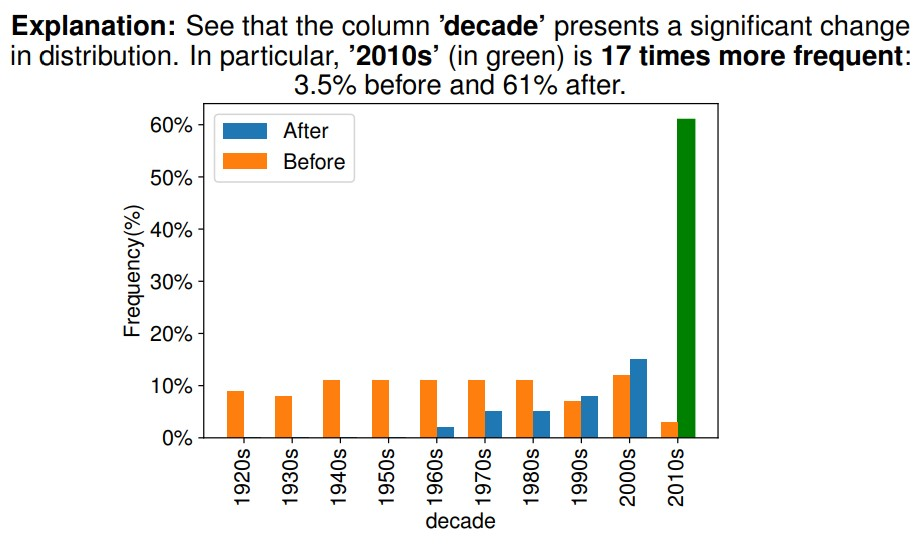
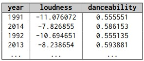
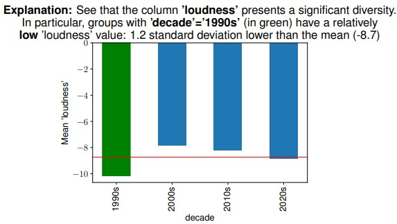

# Fedex
### Introduction
FEDEx is a system that assists in the process of EDA (Exploratory Data Analysis) sessions - you can use FEDEx API instead of pandas and execute various operations (currently supports Filter, Group By and Join) on your data on real-time and it will generate NL explanations + Visualizations to your queries results. The explanations are coherent and costumized specifically to your query - It explains what is actually interesting in the query itself or it's result dataframe. 

### How it works
FEDEx is built of multiple parts, the high level process is:

1. The user enters input dataframe and a query (Filter/GroupBy/Join) and it's parameters. 
2. FEDEx executes the query
3. Then FEDEx calculates an Interestingness Measure (that works well with the specific operation, for example Exceptionality measure for Filter and Join operations) for every column in the output dataframe (the query result)
4. FEDEx finds the most interesting columns and partition them to set of rows.
5. Then It finds the set-of-rows that affects the Interesingness measure result the most (from [2]).
6. Now FEDEx takes the top columns and set-of-rows and generates  meaningful explanations

For the full details, you can either view the code or read our article which will be referenced here really soon:)

### Example
We used the spotify dataset from Kaggle.
The first operation of our user was `SELECT * FROM Spotify WHERE popularity > 65;`

The raw output (Snip) -

The generated explanation -

The second operation of the user was `SELECT AVG(dancability), AVG(loudness) FROM [SELECT * FROM Spotify WHERE year >= 1990] GROUPBY year;`

The raw output (Snip) -

The generated explanation -

### Usage

**Notice** - This project was tested on python version 3.6-3.8. 

First, you have to install the requirements - `py -3 -m pip install -r requirements.txt`

Secondly, you should install latex on your system (the explanations inside the graphs require that). Things will still work even without latex but the experince might be a bit inferior.

For now, you can view usage examples at `Notebooks` folder and at `UserStudyInteractive.py`.  We are currently working on a better API that will allow users to use pandas and generate explanations without effort and without using additional dedicated API. You can get sense of how it will work at the `Interactive` notebooks. You should use the functions `join`, `filter_` and `group_by`. If you want to disable FEDEX-Sampling - you should set `SAMPLE` global variable at `UserStudyInteractive.py` to 0. 

Notice that `UserStudyInteractive.py` was designed to be used inside a jupyter notebook, so you should use jupyter notebook or to make several minor changes.
